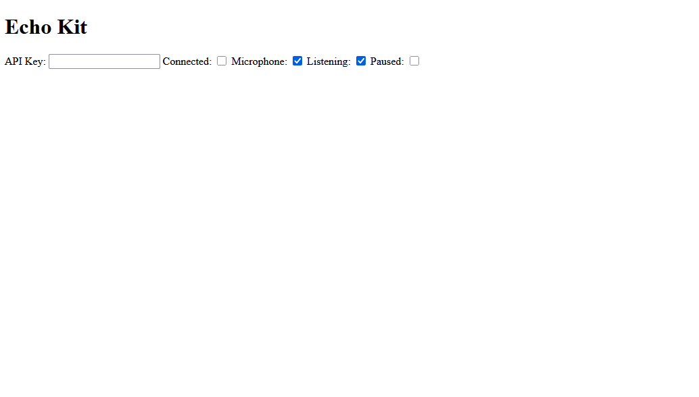

# Echo Kit: Dev Log 1

## What is Echo Kit?

I think it's important to start with the "why" behind this project.

Another one of my projects involves communicating with the Gemini Live API.

The problem? **There is no easy way to integrate Gemini Live into a web application.**

Sure, you can use the API directly, but it complicates things significantly. You have to handle:
- Audio recording from the user's microphone
- Encoding audio data into the correct format
- Managing the WebSocket connection
- Handling reconnections and context windows
- Playing back audio responses from Gemini
- And I'm sure theres more...

Another feature I look forward to adding is support for multiple AI speakers. Session management will be so easy in Echo Kit that it will be trivial to have multiple Gemini Live sessions running simultaneously.

So, yes, *Echo Kit is just another API wrapper library*, and I don't expect many people to find it useful. But it will make my life easier.

## Progress so far

Currenltly, I'm putting everything into a Svelte component called `GeminiLive`.

It's currently capable of:
- Recording audio from the user's microphone
- Sending audio data to the Gemini Live API

Wow, that's not much!

Behind the scenes, though, a lot is happening:
- An `AudioWorkletProcessor` to capture audio data without blocking the main thread
- Downsampling and encoding audio data into the required format (Gemini Live is strict about this)
- A queue to send audio (and other data in the future) to Gemini in a controlled manner

And while you can't hear Gemini's response yet, when I speak into the microphone, I see beautiful base64 data coming back from the API, which I can only hope is a wonderful "hello" back from Gemini.

## Design problems

The hardest part of this project seems to be designing the library itself. I've never really made a reusable component or library before.

1. Why am I using a component? Surely I could just make a class in a `.svelte.ts` file and export that?
    - Still unsure about switching to a class-based approach. If I do switch, I can still add a Svelte component that wraps the class for easy use.
    - I can add a nice UI to the component later, perhaps with visualizations of audio input/output. Of course, that would be optional.
2. Props
    - So many props depend on each other. For example, `listening` depends on `microphone` being true, and `paused` depends on both.
3. Empty audio data
    - In my own project, I had a push-to-talk button. The problem is, when the user isn't pushing, no data at all is sent to Gemini. So, instead of responding, Gemini assumes there is some network issue and waits.
    - To solve this, I always send audio data, even if it is empty.
    - Integrating this into the component is tricky. The `paused` prop is designed to stop sending data entirely, and the `listening` prop is designed to send empty audio data when not listening. But I don't think most developers will have this same use case.
    - I think I need to prioritize the regular, non-push-to-talk use case, and make push-to-talk handling an opt-in feature.
4. Input & response modalities
    - Gemini Live is more than just audio. It can handle text I/O and video input too.
    - This library is very audio-centric right now, but I need to design it in a way that allows for easy expansion to other modalities in the future.

## The UI...

The component itself has no UI yet, but I've added some basic checkboxes to the demo page. It's real ugly though:

## The Logo

Honestly, I had a lot of fun making the logo. I used [Lunacy](https://icons8.com/lunacy).

It was originally going to be a horizontally centered audio wave. But as I copied the rounded rectangles and made them each a different size, I liked the top-aligned look.

So, I went with it.
